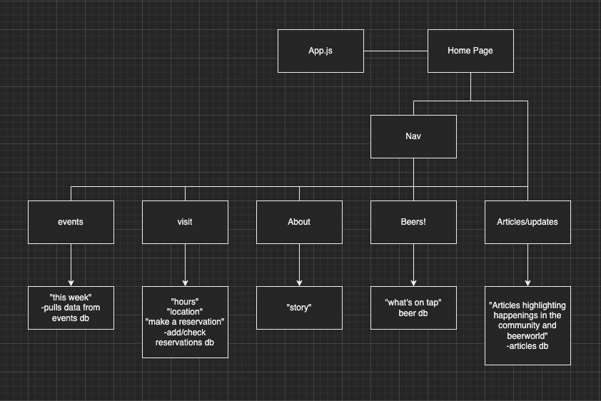
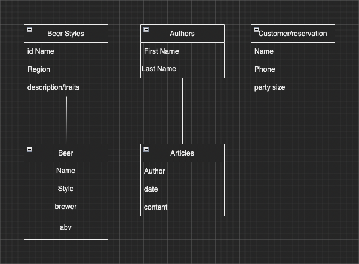

# local-eyes-beerworks

## Date 12/15/21

### By Casey Stewart

#### [LinkedIn](www.linkedin.com/caseystewart22) [Behance](https://www.behance.net/CaseyStewart) [GitHub](www.github.com/CaseyStewart1)

#### [Trello](https://trello.com/b/DokFStrv/local-eyes-beerworks)

\*\*\*

### Description

#### build a full-stack (Mongoose/Express/React/Node), professional-looking application with a functioning backend and frontend. Your website should allow users to interact with its pages, make requests (buttons, HTML forms, dropdowns, searchbars, etc.) to your backend, and display the data (text, images, etc.) in a meaningful way.

### Proposal

#### Local Eyes Beerworks: A website for a local brewery highlighting the surrounding community whether thru collabroative beers or artwork etc.

### Getting Started

#### trello:

#### ERD:

#### CHD

---

### **_Screenshots_**

##### CHD:

##### ERD:

---

**_*Technologies Used*_**

- Tech 1
- Tech 2
  - sub-item 1
  - sub-item 2
- Tech 3

---

#### **Great More Star Wars**

---
